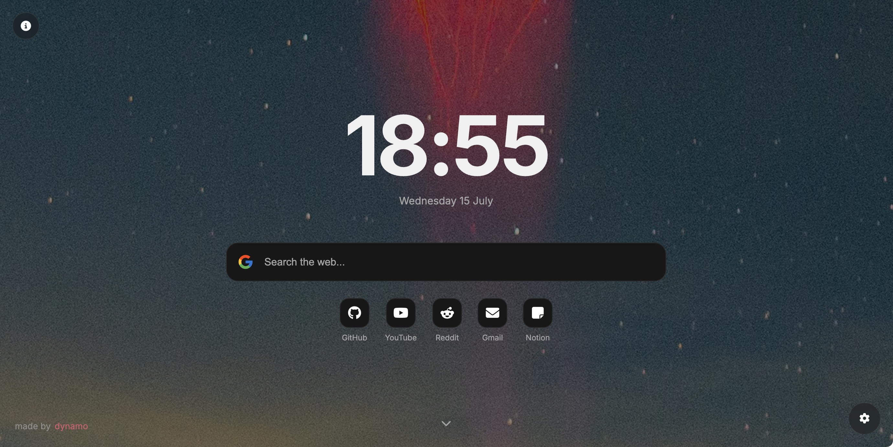

# newtab
a minimalistic (i guess it is), clean and modern looking custom new tab page that gets its background from nasa's astronomy picture of the day api.

## description
get rid of your boring, lifeless and default newtab page. this is a functional new tab page that provides modern aesthetics and limited customizability. has multiple search engines available (google, duckduckgo, brave, startpage). also features a news section where news are classified into categories (all, tech, science, business, sports and entertainment). the background images are updated from nasa's apod (astrology picture of the day).

## features
- responsive
- multiple search engine options
- apod background images
- dark & light themes
- switchable accents
- news section (that is categorized)
- favorites section

## language
- HTML
- CSS
- JavaScript

## browser support
- all browsers (chrome, edge, firefox, brave etc)

## API used
1. [apod from nasa](https://apod.nasa.gov/apod/astropix.html)
2. [gnews api](https://gnews.io/)

## screenshots and videos

---

- made by sai siddardha
